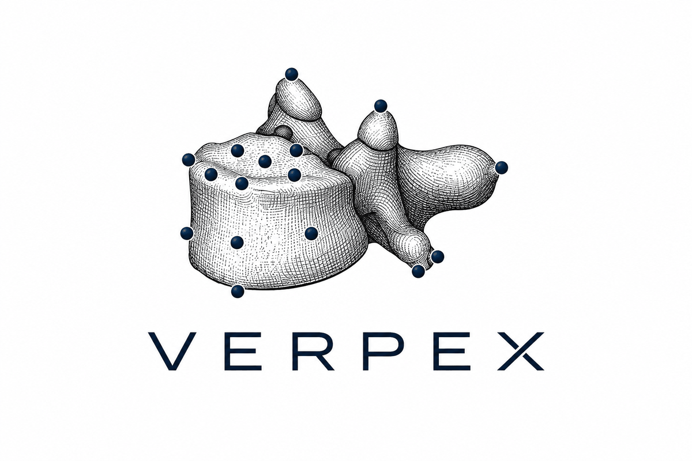

<h1 align="center">

</h1><br>

Deep-learning prediction of anatomical points-of-interest (POIs) on vertebrae, from CT
and MRI spine segmentations.

The model works one vertebra at a time. A DenseNet backbone predicts a heatmap per
landmark on a fixed-size cutout, and a transformer then refines those coarse coordinates
using image patches taken around them, so the final prediction is sub-voxel accurate.

Built on [TPTBox](https://github.com/Hendrik-code/TPTBox) for BIDS dataset handling,
NIfTI I/O and POI containers.

## Installation

Requires Python 3.10 or newer.

```bash
conda create -n verpex python=3.10
conda activate verpex

pip install -e .
```

For the sparse-convolution backbones (`SMDenseNet`, `SMSADenseNet`) also install
`spconv` matching your CUDA version — the dense pipeline does not need it.

## Configuration

Machine-specific paths live in `config/paths.yaml`, which is git-ignored. Copy the
template and fill it in:

```bash
cp config/paths.example.yaml config/paths.yaml
```

| Key | Used for |
| --- | --- |
| `data_root` | BIDS dataset(s) to read images and annotations from |
| `cutout_root` | where `prepare-data` writes cutouts and `master_df.csv` |
| `model_root` | trained model directories and their checkpoints |
| `output_root` | evaluation and inference results |
| `tmp_root` | scratch space (defaults to `/tmp/verpex`) |

Every key can be overridden by an environment variable — `data_root` becomes
`VERPEX_DATA_ROOT`, and so on — which takes precedence over the file. A key that is
needed but unset raises a `PathConfigError` naming exactly what to set.

## Preparing data

A BIDS-like dataset is expected:

```text
dataset/
├── rawdata/…              CT or MR image
└── derivatives/…          vertebra instance mask, subregion mask, POI json
```

Whole scans do not fit in GPU memory, so each vertebra is cut out, brought to a standard
orientation and spacing, and written to disk once up front:

```bash
verpex-prepare-data --data_path $DATASET --derivatives_name derivatives --save_path $CUTOUTS
```

This writes one directory per vertebra plus a `master_df.csv` listing them. Paths in that
CSV are **relative to the cutout root**, so the file stays valid if the data moves.

A `master_df.csv` produced before this change stored a longer relative path (e.g.
`dataset/data_preprocessing/cutout-folder/cutouts/<subject>/<vertebra>`). Such files
still work — point `cutout_root` at the directory those paths are relative to, rather
than at the `cutouts/` directory itself. Absolute paths in old files are also honoured
unchanged.
It uses 8 worker processes by default (`--n_workers`), takes minutes to hours, and needs
several GB of disk.

## Training

Experiments are described by a JSON config. `verpex/configs/example_train.json` is a working
starting point; fill in `master_df` and the subject splits.

```bash
verpex-train --config verpex/configs/example_train.json
```

Components are addressed by a `"type"` string resolved through an explicit registry, so a
config names a model rather than importing one:

```json
{"type": "PatchTransformer", "params": {"n_landmarks": 35, "patch_size": 16}}
```

Registered names live in `verpex.registry` and the `*_MODULES` dicts beside each family
of components. An unknown name raises an error listing the valid ones.

Pass `--config-dir` instead to run every config in a directory in sequence, or use
`verpex-train-cv --n_folds 5` for cross-validation.

## Evaluating and predicting

```bash
verpex-eval  --checkpoint_path $CKPT --split test --project
verpex-infer --datasets $DATASET_NAME --der_msk derivatives
```

`verpex-eval` writes per-POI, per-vertebra and per-subject metric CSVs plus an outlier
list. All errors are in millimetres. `verpex-infer` runs the full pipeline from raw
masks to a BIDS POI file.

## Development

```bash
pip install -e . && pip install pytest ruff mypy pre-commit pandas-stubs types-PyYAML
pre-commit install

pytest
ruff check . && ruff format --check .
mypy
```

The test suite runs on synthetic tensors and needs no dataset. See
[CONTRIBUTING.md](CONTRIBUTING.md) for the conventions this codebase expects.


## Citation

If you use this codebase, please cite the following reference

```
TBD [Paper not yet published]
```
